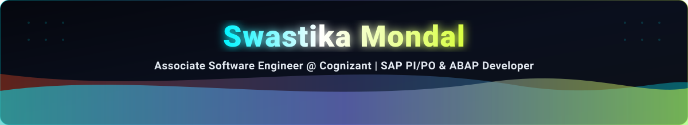

  <!-- Header Banner -->
  

    
  

  <!-- Centered Avatar with Cyan / Cyber Lime Ring Frame -->
  

    
  

  <h1 align="center">Hi 👋, I'm Swastika Mondal</h1>

  <!-- Smooth Single-line Rotating Typing SVG -->
  

    

  <!-- Profile Views & Social Badges -->
  

    
    &nbsp;
    
    &nbsp;
    
  

<!-- Cute Glowing Animated Divider Line -->

  

<!-- ✨ About Me Section -->

### ✨ About Me

👋 Hello! I'm **Swastika Mondal**, an **Associate Software Engineer at Cognizant** based in West Bengal, India.

I specialize in **enterprise middleware integration using SAP PI/PO** (Process Integration & Process Orchestration), **SAP ABAP core development**, and **modern Full Stack web architecture**. I love connecting distributed enterprise systems, automating business data exchange, and exploring the frontiers of Prompt Engineering & Generative AI.

- 💼 **Current Role:** Associate Software Engineer (Full-Time Employee - FTE) at **Cognizant Technology Solutions**
- 🔭 **Current Focus:** SAP PI/PO middleware interfaces, ESR message mappings, and adapter orchestration (IDoc, RFC, SOAP, REST)
- ⚙️ **Enterprise Background:** Completed 3-month intensive corporate training in **SAP ABAP** core modularization, DDIC, and enterprise reporting
- 🎓 **Education:** Bachelor of Computer Applications (BCA) from **Techno India Hooghly** *(8.00 CGPA)*
- 📜 **Certifications:** Prompt Engineering & Generative AI Specialist, Google UX Design Professional Certificate, HTML5 & CSS3
- 💡 **Key Projects:** [Trip On Tip](https://github.com/Swastika-Mondal/tripplanner) (AI Travel Itinerary Engine), [Multi-Threat Detection](https://github.com/Swastika-Mondal/Multi-Threat-Detection) (IoT & NLP Cybersecurity), [quizXpoint](https://github.com/Swastika-Mondal/quizXpoint) (Online Examination & Certification Portal)
- 💬 **Ask Me About:** SAP PI/PO, SAP ABAP, Python, React, FastAPI, Message Mappings, Enterprise Integration
- ⚡ **Fun Fact:** *I translate complex enterprise schemas by day and craft responsive AI apps by night! ☕*

 

<!-- Cute Glowing Animated Divider Line -->

  

<!-- 🎯 Core Engineering Disciplines -->

  <h3>🎯 Core Engineering Pillars</h3>

  <table>
    <tr>
      <td width="33%" align="center" valign="top">
        <h4>🌐 Enterprise SAP Integration</h4>
        
Designing SAP PI/PO interfaces, ESR object schemas, message mappings, UDFs, and adapter channels (IDoc, RFC, SOAP, REST) for Cognizant enterprise clients.

      </td>
      <td width="33%" align="center" valign="top">
        <h4>🤖 Generative AI &amp; Prompt Engineering</h4>
        
Architecting structured system prompts, few-shot reasoning models, and integrating multimodal LLMs (Gemini API in Trip On Tip) for dynamic task automation.

      </td>
      <td width="33%" align="center" valign="top">
        <h4>🚀 Full Stack &amp; Systems</h4>
        
Building high-performance web and desktop systems utilizing React, Next.js, Python, Flask, FastAPI, Electron, and MongoDB.

      </td>
    </tr>
  </table>

<!-- Cute Glowing Animated Divider Line -->

  

<!-- 🚀 Featured Projects Spotlight -->

  <h2>🚀 Featured Projects Spotlight</h2>

  <table>
    <tr>
      <td width="33%" align="center" valign="top">
        <h4>✈️ Trip On Tip (AI Travel Planner)</h4>
        
AI-powered travel itinerary engine generating customized trip routes via Gemini AI &amp; FastAPI backend.

        

          
        

      </td>
      <td width="33%" align="center" valign="top">
        <h4>🛡️ Multi-Threat Cybersecurity</h4>
        
Dual defensive monitoring system analyzing real-time IoT packet anomalies and NLP cyberbullying text harassment.

        

          
        

      </td>
      <td width="33%" align="center" valign="top">
        <h4>📝 quizXpoint Exam Portal</h4>
        
Scalable online examination platform with timed MCQ tests and automated digital verifiable certificate generation.

        

          
        

      </td>
    </tr>
  </table>

<!-- Cute Glowing Animated Divider Line -->

  

<!-- 🛠️ Tech Stack & Skills -->

  <h2>🛠️ Tech Stack &amp; Weapons of Choice</h2>
  
Enterprise technologies, languages, and frameworks in my everyday toolkit:

  
    
  

    
    &nbsp;
    
    &nbsp;
    
    &nbsp;
    
  

 

<!-- Cute Glowing Animated Divider Line -->

  

<!-- 🤝 Connect With Me Section -->

  <h2>🤝 Let's Connect &amp; Collaborate!</h2>
  
Feel free to reach out for enterprise collaborations, engineering inquiries, or tech chats:

  
  <!-- Row 1: The Round 3D Animated Social Buttons -->
  

    
    &nbsp;&nbsp;
    
    &nbsp;&nbsp;
    
  

   

  <!-- Row 2: Badges -->
  

    
    &nbsp;
    
    &nbsp;
    
    &nbsp;
    
  

 

<!-- Cute Glowing Animated Divider Line -->

  

<!-- 📊 GitHub Analytics & Streak Cards -->

  <h2>📊 GitHub Activity &amp; Statistics</h2>

  

    
    
  

  

    
  

<!-- Cute Glowing Animated Divider Line -->

  

<!-- 🐍 Contribution Snake Graph -->

  <h2>🐍 Contribution Snake Graph</h2>
  <picture>
    <source media="(prefers-color-scheme: dark)" srcset="https://raw.githubusercontent.com/Swastika-Mondal/swastikamondal/output/github-contribution-grid-snake-dark.svg" />
    <source media="(prefers-color-scheme: light)" srcset="https://raw.githubusercontent.com/Swastika-Mondal/swastikamondal/output/github-contribution-grid-snake.svg" />
    
  </picture>
  
    
  
  <!-- Dynamic Tech Quote -->
  
  
    

  

    <b>⭐ Crafted with passion by <a href="https://github.com/Swastika-Mondal">Swastika Mondal</a> | Star &amp; Follow if you find my repositories helpful! ⭐</b>
  

<!-- Bottom Cyberpunk Wave -->

